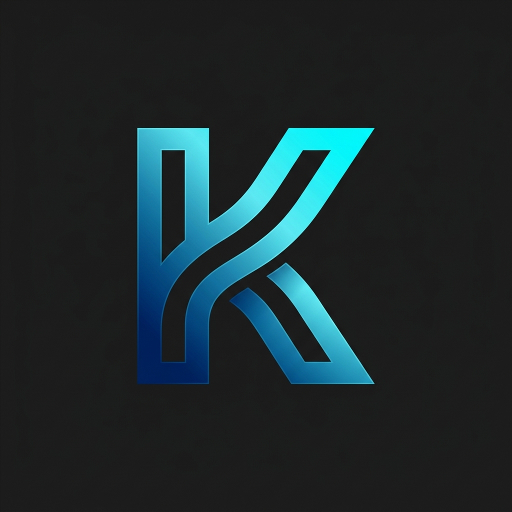

# Kombat IT Solutions - Advanced Enterprise Website



A high-performance, premium B2B corporate website redesigned for Kerala's leading banking and IT infrastructure partners. This project features a cinematic UI, reactive theme management, and immersive parallax scrolling backgrounds.

## 🚀 Vision
To provide a trust-focused, technologically superior digital identity for **Kombat IT Solutions**, specializing in enterprise-grade hardware support and networking for the financial sector.

## ✨ Premium Features
- **Cinematic Preloader**: Multi-ring high-tech loading animation.
- **Advanced Parallax Engine**: Each major section features high-resolution enterprise IT photography anchored with fixed scroll depth.
- **Adaptive UI Architecture**: 100% theme-aware CSS system supporting a high-contrast Dark Mode and a crisp Professional Light Mode.
- **Floating Tool Center (FAB)**: Expandable quick-tools menu with scroll-to-top, page refresh, and cart functionality.
- **Interactive Branding**: Grayscale-to-color logo carousel with futuristic audio-beep feedback on hover.
- **WhatsApp Integration**: Single-click "Request a Service" CTA with pre-filled message templating.

## 🛠️ Technology Stack
- **Core**: Vanilla HTML5, CSS3 Variable-driven architecture.
- **Interactions**: Vanilla JavaScript (no external libraries for high performance).
- **Audio**: Web Audio API for custom UI beep síntesis.
- **Typography**: Optimized Google Fonts (Roboto & Open Sans).

## 📂 Project Structure
```text
/assets/images/      - Photography, brand icons, and favicons.
/css/style.css       - Complex layout engine and theme management.
/js/main.js          - Audio synthesis, scroll-reveal, and FAB logic.
index.html           - Main enterprise homepage.
careers.html         - Interactive corporate career portal.
template.html        - Reusable boilerplate for future site extensions.
```

## 👨‍💻 Development
This website was built with a focused priority on **Aesthetics** and **Trust**. Every interaction is designed to make the firm look like a top-tier industry leader.

---
© 2026 Kombat IT Solutions. Designed by [Sooraj](https://instagram.com/zoorajvs).
